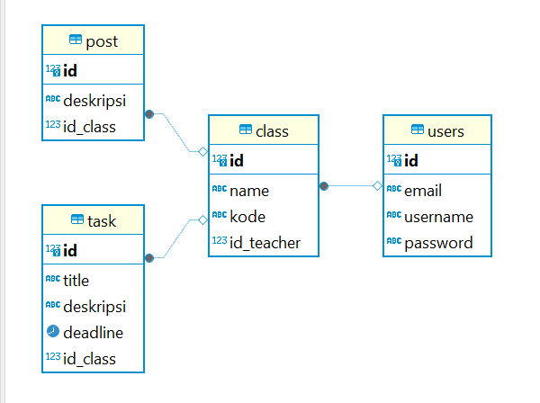

# Smart Class

Smart Class adalah platform manajemen pembelajaran yang menyederhanakan cara guru dan siswa berinteraksi secara digital. Dengan fitur untuk membuat kelas, membagikan materi, dan mengelola tugas, Smart Class menjadikan pembelajaran lebih efisien dan terorganisir. Kami berkomitmen untuk menyediakan pengalaman belajar yang fleksibel dan terintegrasi, baik untuk pembelajaran jarak jauh maupun di kelas.

## fitur
- Registrasi dan Login
- Home 
- Class (CRUD, search, sorting asc & desc)
- Di dalam hal. Class
    - Post (CRUD)
    - Task (CRUD)
- Profil (CRUD)
- About
- Logout

## Diagram ERD
 

## Tech stack 
- Frontend: react.js, tailwind CSS
- Backend: Node.js, Express
- DB: postgresSql
